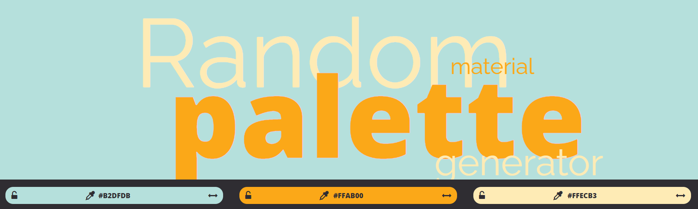
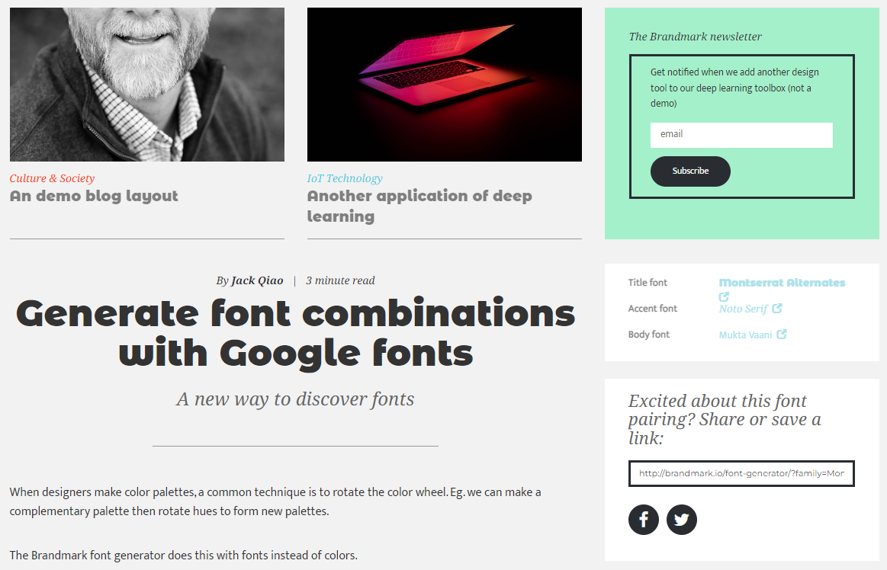

# Sugar Packet SVG Design

## Wireframe

## Color Palette
## #b2dfdb #ffab00 #ffecb3

## Font Pairing
### Montserrate Alternates, Noto Serif, Mukta Vaani

<>

link rel="preconnect" href="https://fonts.googleapis.com"
link rel="preconnect" href="https://fonts.gstatic.com" crossorigin
link href="https://fonts.googleapis.com/css2?family=Montserrat+Alternates:wght@900&family=Mukta+Vaani:wght@400;800&family=Noto+Serif:ital@1&display=swap" rel="stylesheet"

CSS

body, html{
font-family: "Mukta Vaani";
font-weight: normal;
font-style: normal;
}

h1{
font-family: "Montserrat Alternates";
font-weight: 900;
font-style: normal;
}

h2, h3, h4{
font-family: "Noto Serif";
font-weight: normal;
font-style: oblique;
}
